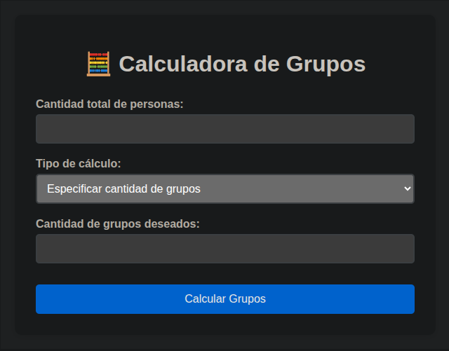
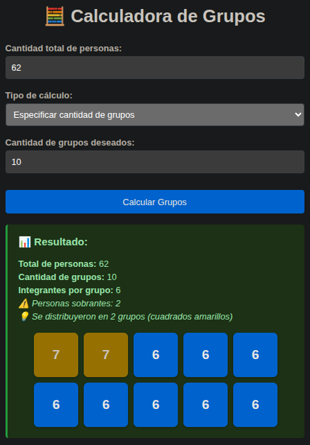

# Calculadora de Grupos
## Descripción
Es una aplicación web simple que permite a los usuarios calcular la cantidad de grupos necesarios para dividir un número total de personas en grupos de un tamaño específico. O también puede calcular el tamaño de cada grupo dado un número total de personas y una cantidad específica de grupos.

## Ejemplo de uso

